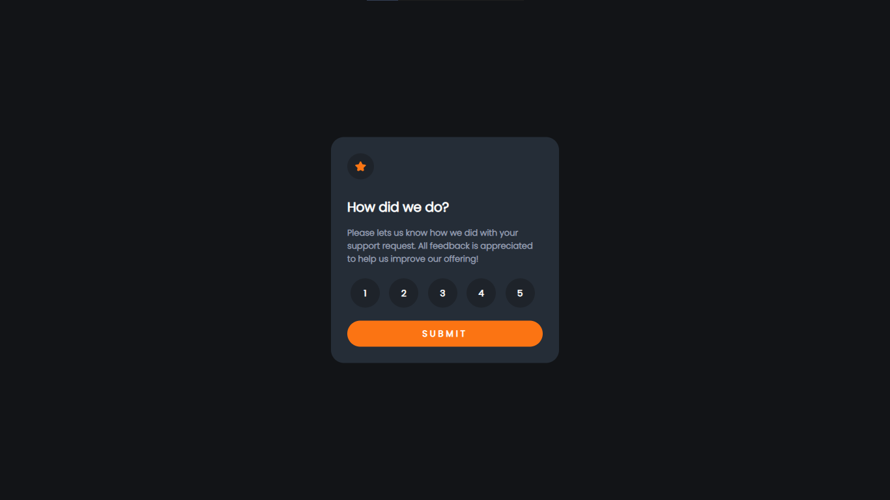

# Frontend Mentor - Interactive rating component solution

This is a solution to the [Interactive rating component challenge on Frontend Mentor](https://www.frontendmentor.io/challenges/interactive-rating-component-koxpeBUmI). Frontend Mentor challenges help you improve your coding skills by building realistic projects. 

## Overview

### The challenge

Users should be able to:

- View the optimal layout for the app depending on their device's screen size
- See hover states for all interactive elements on the page
- Select and submit a number rating
- See the "Thank you" card state after submitting a rating

### Screenshot

### Links

- Solution URL: [Add solution URL here](https://github.com/dannyswagg/Interactive-Rating-Component)
- Live Site URL: [Add live site URL here](https://dannyswagg.github.io/Interactive-Rating-Component/)

## My process

### Built with

- Semantic HTML5 markup
- CSS custom properties
- Flexbox
- CSS Grid
- Mobile-first workflow

### What I learned

This project has been able to help me learn very important tools that will further help my career as a frontend developer. 

## Author

- Website - [Ugiomoh Daniel](https://github.com/dannyswagg)
- Frontend Mentor - [@dannyswagg](https://www.frontendmentor.io/profile/dannyswagg)
- Twitter - [@dannyswagg_](https://www.twitter.com/yourusername)

